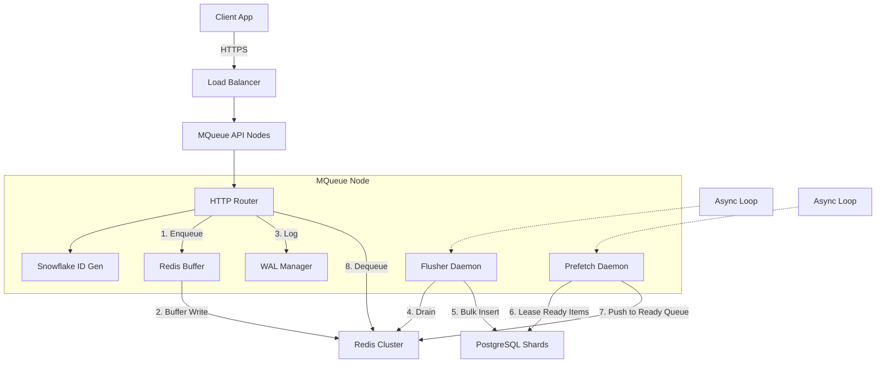
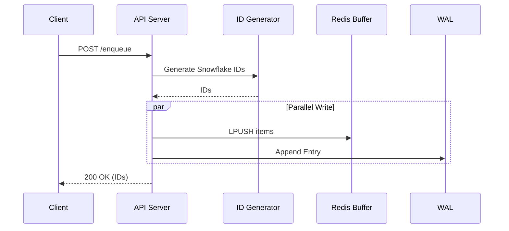
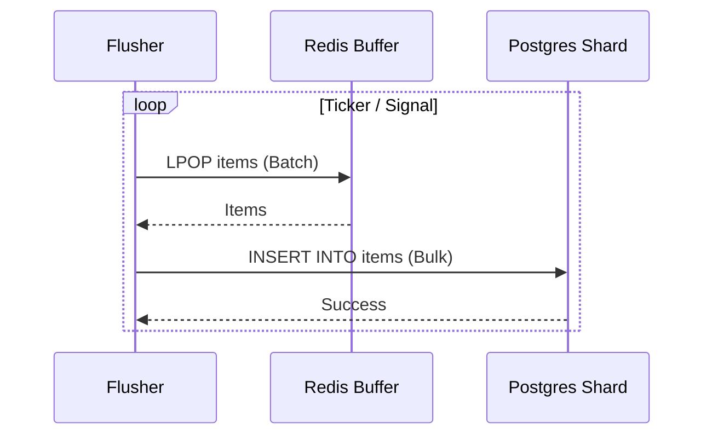
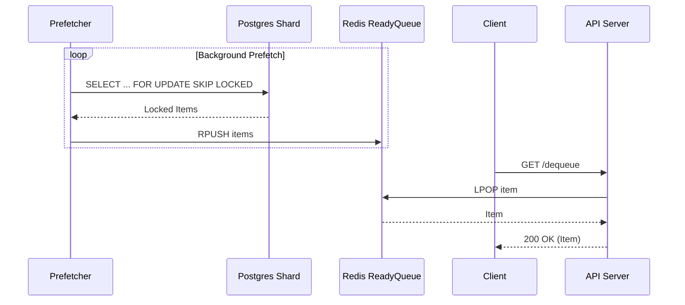
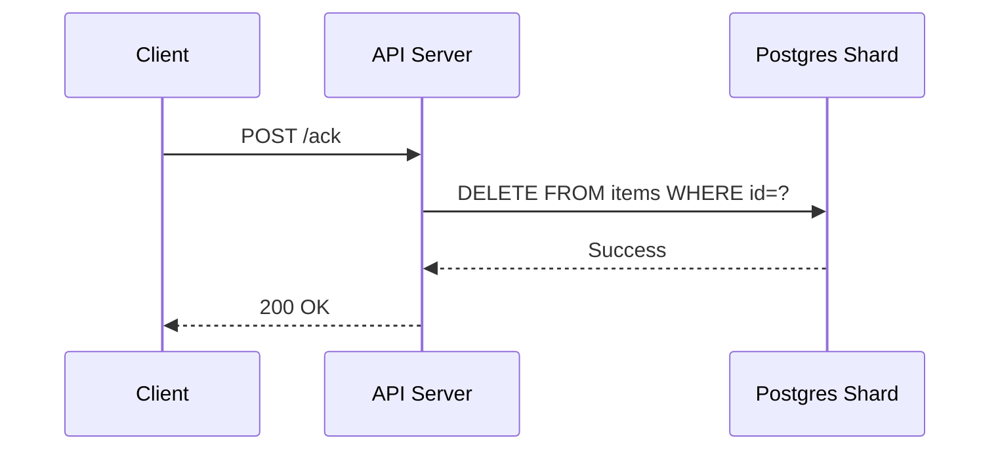

# MQueue System Design Document

## 1. Executive Summary
MQueue is a distributed, sharded, high-throughput priority message queue. It is designed to decouple producers from consumers, allowing for asynchronous job processing, delayed scheduling, and reliable at-least-once delivery.

**Core Philosophy:**
*   **Write Fast:** Use Redis and Write-Ahead Logs (WAL) for immediate acknowledgement.
*   **Read Smart:** Use background prefetchers to move high-priority items from disk to memory.
*   **Scale Horizontally:** Shard data across multiple PostgreSQL instances based on `(namespace, topic)`.

---

## 2. High-Level Architecture



---

## 3. Detailed Data Flow

### 3.1. The Write Path (Enqueue)

**Goal:** Ingest items as fast as possible without waiting for disk I/O on the database.

1.  **Request:** Client sends `POST /enqueue` with a batch of items.
2.  **ID Generation:** 
    *   The `IDGen` component generates a **Snowflake ID** for each item.
    *   Format: `[Timestamp (41b) | NodeID (10b) | Sequence (12b)]`.
    *   *Benefit:* Global uniqueness and time-ordering without DB coordination.
3.  **Buffering (Fast Path):**
    *   Items are serialized and pushed to a Redis List (`mqueue:buffer:{namespace}:{topic}`).
    *   Items are concurrently written to a local **WAL (Write-Ahead Log)** file for durability in case of total crash.
4.  **Ack:** The API returns `200 OK` with the generated IDs to the client. Latency is sub-millisecond (network + Redis RTT).
5.  **Flushing (Async Path):**
    *   The `Flusher` daemon wakes up (ticker or signal).
    *   It pulls a batch (e.g., 50 items) from the Redis buffer.
    *   It determines the target PostgreSQL shard using `hash(namespace + topic)`.
    *   It executes a `INSERT INTO items ...` (Bulk Insert) transaction.
    *   On success, it removes items from Redis.



### 3.2. The Read Path (Dequeue)

**Goal:** Serve high-priority items instantly from memory, avoiding random DB reads on every request.

1.  **Prefetching (Background):**
    *   The `Prefetcher` daemon monitors active topics.
    *   It runs a query on the PostgreSQL shard:
        ```sql
        SELECT ... FROM items 
        WHERE status='ready' AND deliver_after <= NOW()
        ORDER BY priority ASC, deliver_after ASC
        LIMIT 50
        FOR UPDATE SKIP LOCKED
        ```
    *   It sets `lease_expires_at` (locks the items).
    *   It pushes these items into a Redis List (`mqueue:queue:{namespace}:{topic}`).
2.  **Dequeueing:**
    *   Client sends `GET /dequeue`.
    *   Accesses the Redis List directly (`LPOP`).
    *   *Result:* extremely fast dequeue latency (Redis speed).
    *   If Redis is empty, it falls back to a direct DB lease (slow path), ensuring correctness.

### 3.3. Completion (Ack/Nack)

1.  **Ack**: Client sends `POST /ack`.
    *   System deletes the row from PostgreSQL.
2.  **Nack**: Client sends `POST /nack`.
    *   System updates `retries++`, `status='ready'`, and `deliver_after = NOW() + backoff`.

---

## 4. API Reference

All Endpoints are prefixed with `/`. 
**Auth:** header `Authorization: Bearer <JWT_TOKEN>` required.

### 4.1. Enqueue
**URL:** `POST /enqueue`
**Body:** Array of Item objects
```json
[
  {
    "namespace": "payments",
    "topic": "process-refund",
    "priority": 1,
    "payload": "<base64_data>",
    "deliver_after": "2023-10-27T10:00:00Z"
  }
]
```
**Response:** `200 OK` `[1234567890, 1234567891]` (List of IDs)

### 4.2. Dequeue
**URL:** `GET /dequeue`
**Query Params:**
*   `namespace`: (string, required)
*   `topic`: (string, required)
*   `limit`: (int, default=10)
**Response:** `200 OK`
```json
[
  {
    "id": 1234567890,
    "payload": "<base64_data>",
    "lease_expires_at": "..."
  }
]
```

### 4.3. Acknowledge
**URL:** `POST /ack`
**Body:**
```json
{
  "id": 1234567890,
  "namespace": "payments",
  "topic": "process-refund"
}
```
**Response:** `200 OK`

### 4.4. Negative Acknowledge
**URL:** `POST /nack`
**Body:**
```json
{
  "id": 1234567890,
  "namespace": "payments",
  "topic": "process-refund",
  "error": "Payment gateway timeout"
}
```
**Response:** `200 OK`

---

## 5. Storage Schema

### 5.1. PostgreSQL (Table: `items`)
Sharded across N databases.

| Column | Type | Description |
| :--- | :--- | :--- |
| `id` | `BIGINT` | Primary Key (Snowflake ID) |
| `namespace` | `TEXT` | Multi-tenant isolation key |
| `topic` | `TEXT` | Logical queue name |
| `status` | `TEXT` | 'ready', 'leased', 'processing' |
| `priority` | `INT` | Lower value = Higher priority |
| `payload` | `BYTEA` | The job data |
| `deliver_after` | `TIMESTAMPTZ` | Scheduled delivery time |
| `lease_expires_at`| `TIMESTAMPTZ` | Visibility timeout |
| `created_at` | `TIMESTAMPTZ` | Audit timestamp |

**Indexes:**
*   `(namespace, topic, status, priority, deliver_after)`: For high-speed prefetching.
*   `(namespace, idempotency_key)`: For deduplication.

### 5.2. Redis Keys
*   `mqueue:buffer:{namespace}:{topic}`: **List**. Temporary Write Buffer.
*   `mqueue:queue:{namespace}:{topic}`: **List**. Leased Ready Queue (Prefetched items).
*   `mqueue:rate:{namespace}`: **Counter**. For rate limiting.

---

## 6. Scalability & Reliability

### 6.1. Sharding Strategy
*   **Algorithm**: `FNV32a(namespace + topic) % NumShards`.
*   **Implication**: All items for a specific topic live on the same PG shard.
*   **Constraint**: A single topic cannot exceed the write capacity of one PG node.

### 6.2. Failure Modes
*   **Shard Down**: Writes to that shard fail immediately (500 Error). Reads stop. Data remains safe on disk.
*   **Redis Down**: System degrades to "Slow Mode" (Direct DB writes/reads) OR fails if configured for reliability over availability. Current config fails writes if Redis is down (to protect WAL integrity).
*   **Node Crash**:
    *   **In-Memory Buffer**: Lost from RAM.
    *   **Recovery**: On startup, node reads `WAL` directory and replays any un-flushed items.

### 6.3. Graceful Shutdown
1.  **Stop HTTP**: Rejects new requests (503).
2.  **Drain Buffer**: Flusher runs one last time until Redis buffer is empty.
3.  **Exit**: Process terminates only after data is safe in Postgres.
